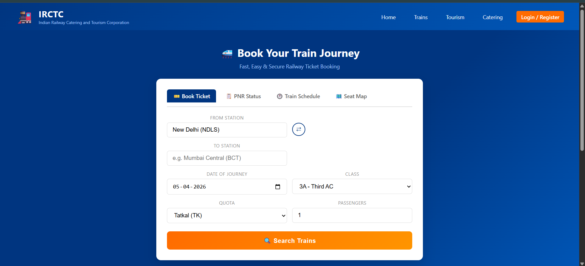
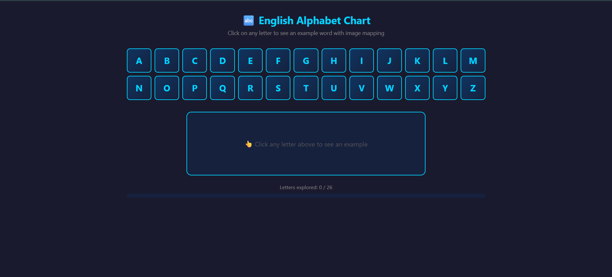
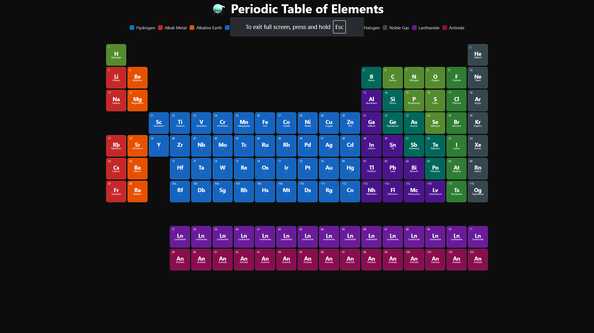
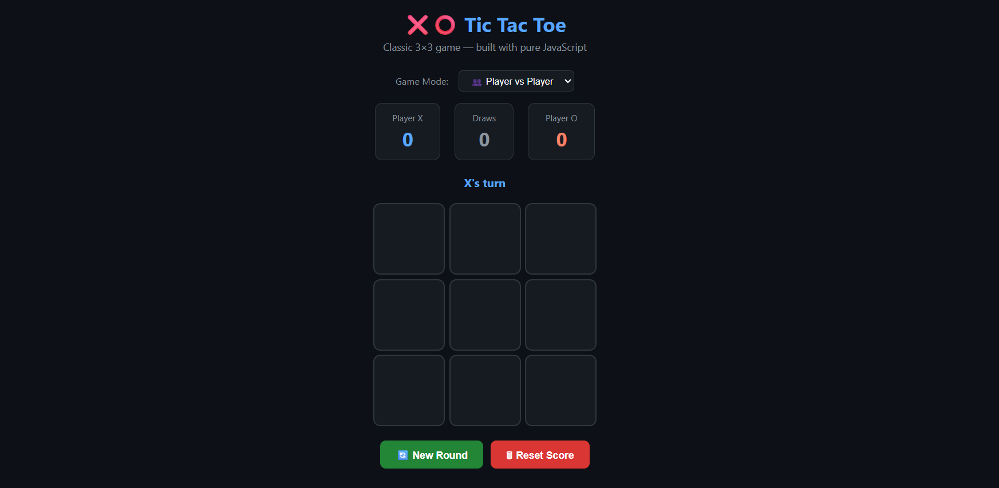
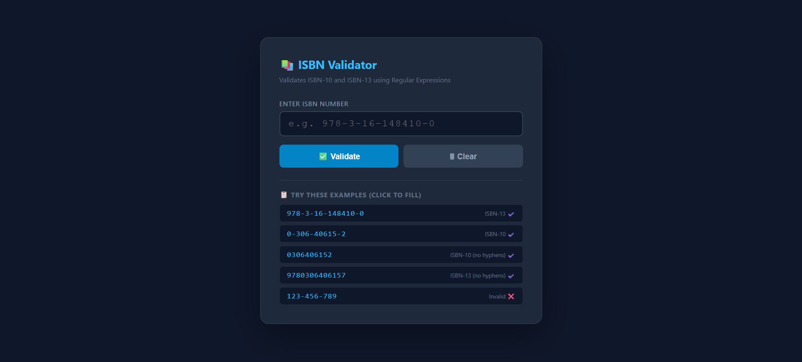

# 🚀 Web Technology Practicals


A complete collection of **11 Web Technology Practicals** covering frontend, backend, database integration, and scripting.

---

## 📌 Table of Contents

* [Overview](#-overview)
* [Tech Stack](#-tech-stack)
* [Practicals List](#-practicals-list)
* [Screenshots](#-screenshots)
* [Setup & Execution](#-setup--execution)
* [Key Features](#-key-features)
* [Author](#-author)

---

## 📖 Overview

This repository is designed for students and beginners to understand core web development concepts through hands-on practicals.

Each practical is:

* ✅ Self-contained
* ✅ Beginner-friendly
* ✅ Easy to run

---

## 🛠 Tech Stack

* **Frontend:** HTML, CSS, JavaScript
* **Backend:** PHP
* **Database:** MySQL
* **Markup & Validation:** XML, XSD
* **Scripting:** Perl

---

## 📂 Practicals List

| #  | Practical        | Description            |
| -- | ---------------- | ---------------------- |
| 1  | IRCTC Page       | Basic HTML layout      |
| 2  | Alphabet App     | JavaScript interaction |
| 3  | Periodic Table   | Styled UI with logic   |
| 4  | ISBN Validator   | Regex validation       |
| 5  | Tic Tac Toe      | Game logic             |
| 6  | Matrix Transpose | Array operations       |
| 7  | Hospital Form    | Form validation        |
| 8  | Shopping Cart    | PHP Sessions           |
| 9  | Quiz App         | PHP + MySQL            |
| 10 | XML Students     | XML + XSD validation   |
| 11 | Perl Arrays      | Perl scripting         |

---

## 📸 Screenshots

### 🧾 IRCTC Page


### 🔤 Alphabet App


### 🧪 Periodic Table


### 🎮 Tic Tac Toe


### 📚 ISBN Validator

---

## ⚙️ Setup & Execution

### 🌐 HTML / JS / CSS (P1–P7)

Open directly in browser:

```bash id="run1"
double-click .html file
```

---

### 🛒 PHP Shopping Cart (P8)

```bash id="run2"
php -S localhost:8000 practical8_shopping_cart.php
```

Open: `http://localhost:8000`

---

### 🧠 PHP Quiz App (P9)

1. Open **phpMyAdmin**
2. Copy SQL from the file
3. Execute queries
4. Run:

```bash id="run3"
php -S localhost:8000
```

---

### 📄 XML + XSD (P10)

Ensure all files are together:

* `students.xml`
* `students.xsd`
* HTML file

Then open HTML file.

---

### 🐪 Perl Script (P11)

```bash id="run4"
perl practical11_perl_arrays.pl
```

---

## ✨ Key Features

* ✔️ Form validation using JavaScript
* ✔️ Game development logic
* ✔️ Regex-based validation
* ✔️ PHP session handling
* ✔️ Database connectivity (MySQL)
* ✔️ XML schema validation
* ✔️ Cross-technology learning

---

## 📁 Project Structure

```bash id="tree"
.
├── practical1_irctc.html
├── practical2_alphabet.html
├── practical3_periodic_table.html
├── practical4_isbn_validator.html
├── practical5_tictactoe.html
├── practical6_matrix_transpose.html
├── practical7_hospital_form.html
├── practical8_shopping_cart.php
├── practical9_quiz_app.php
├── practical10_xml_students.html
├── students.xml
├── students.xsd
├── practical11_perl_arrays.pl
└── screenshots/
```

---

## 👤 Author

GitHub: https://github.com/CipherxHub

---

## ⭐ Show Your Support

If you found this useful, please ⭐ the repository and share it.

---
